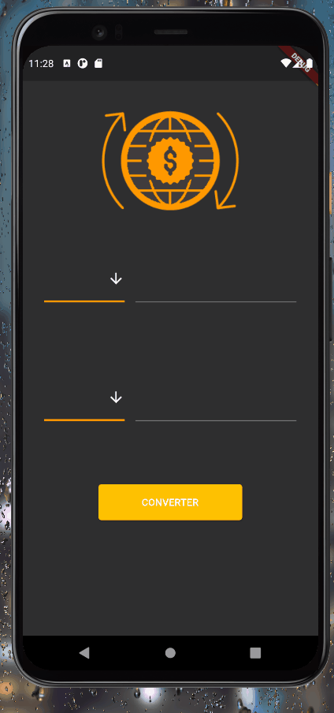

<h1 align="center">Currency Converter APP 💶</h1>

This is a mobile project made with flutter, to convert a currency to another

This app is on V2.0

 

<h1 align="center">
  

</h1>

### Features

- [x] Basic Currency Options
- [x] Currency Converter
- [ ] Currency API
- [ ] Bitcoin Converter

### Tools

The following tools have been used in the project:

- [Dart](https://dart.dev/)
- [Flutter](https://flutter.dev)
- [Android Studio Emulator](https://developer.android.com/studio)
- [VS Code](https://code.visualstudio.com)
---

### Author
Made by Johan Stromberg :fire:

<h4 align="center">
  🚧  Work In Progress...  🚧
</h4>
